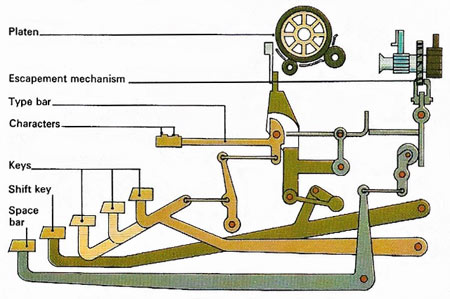
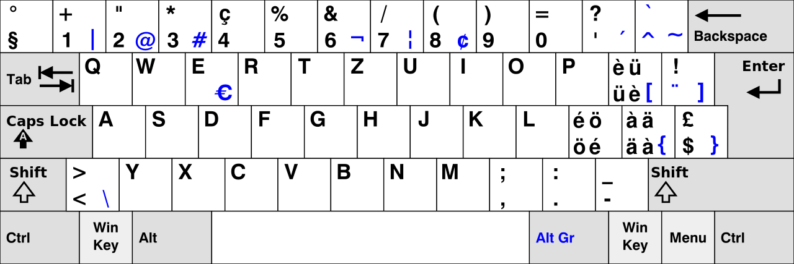

I would not consider myself a tech freak when it comes to hardware. I
particularly dislike chasing the best choice of the next piece of hardware I do not actually
need. Some day back at my internship I had this colleague that owned definitely more keyboard's than he needed, and he was happy to lend one out for however long it was necessary to get hooked.
It was not all that long.

In the retroperspective it seems so unprogressive. We have been typing on the same type of input devices since the early days of typewriters.
They were impressively small mechanical machines, so it used to be expensive and meant something to own a decent model from a popular brand with a dedicated store.
My mum told me about her using one at her first job, when she was still one of the few to know how to properly write on these [antique machines](https://www.antiquetypewriters.com/collection/).
She did not know till I showed her that the layout was designed to fulfill the machine's requirements - not the human's needs. The horizontal position of the keys is shifted in every row to allow the arms (_key levers_) attached to the keys to interact with the mechanics individually.

The tinkerers that designed the first exemplars placed the characters such that the interference between adjacent keys is minimized. While the machines' undergone transformation reflects the last century's developments, the layout of the keys did not change all that much. It's bit like an old Swiss joke: The family decendendants copy grandma's habit to cut off the ends of the sausage and they never realize she did that to fit her old pan.

My colleague lent me his newest acquisition at that time: 
a crowd-sourced [_Ergodox Mechanical Keyboard_](https://www.ergodox.io/), that had to be self-soldered from individual parts. Not expecting to actually buy one, I gave it a try and was fluent in typing text and code after less than a week. Way more time went into fine-tuning the layout. After two weeks I joined a running mass order that collected the individual parts from different producers in the US.

## Elevator pitch

What convinced me so quickly? Let me give you a list ordered from the most crucial to the more exotic reasons:
- [Some of the antique typewriter models](https://www.antiquetypewriters.com/typewriter/franklin-2-typewriter/) already offered a superior design, where your arms can stay in a relaxed angle. I realized within days that the Ergodox perfectionated the idea: _the split design_. Since my arms can stay straight, **my shoulders and chest can remain open and more relaxed**.
- My fingers are a bit deformed from Guitar playing, still the **ortholinear positioning of the keys** better matches my fingers shape (and hopefully yours as well!).
- The **high configurability of the keyboard's firmware** itself might sound like a feature you can achieve with some tweaks on your OS, but having it consistent whatever laptop/PC your connecting is so convenient.

## Layout

My software settings are set to use a Swiss German layout since I was used to it and actually like it. It was made to allow for easy typing of French and Italian accents with shifted keys (only one modifier) and so it well supports other European languages.

As you will see, you can tune any layout into a more powerful one, I based it on the Swiss layout to keep the Ergodox layout "compatible" with my laptop's built-in Swiss German layout. "Compatible" means to either position a character/symbol on the analogous spot on the Ergodox or move it _far enough_, for example to the separated thumb keys. My muscle memory gets an easier task and can support me getting up to desired typing speed. It turns out I can seamlessly switch between the Ergodox and a classical layout (not without mental pain though).

 of my Ergodox keyboard layout.")

The downside of this layout is the position of the brackets, especially `()` that I use very frequently while programming. With the free positioning provided by the keyboard's firmware you can move them everywhere, but there are not many spare positions on the keyboard after placing all the letters. (It even misses a column on the right-hand side).

That's where an interesting firmware feature comes into play: **layers**. These are completely independent layouts that you can push on top of the base layer to build a stack of layers. Pushing layers can be triggered by any key you like, and it can be

- temporary; _while you hold_ or
- persistent; after you _toggle_ a key.

Why does the order of the layers pushed to the stack matter? It would not if the layers were independent. However, you can have transparent keys on higher levels to maintain the function of the base layer or a layer below that does not have a transparent key at the specific position. This simplifies the configuration and motivates to keep some frequently used keys (e.g. thumb keys) accessible from most layers.

On my _layer for function and programming keys_ I can arrange my brackets however I wish, so why not go with a sane choice and put them next to each other? I still wanted them to be accessible with just one extra key hold, which is the temporary layer switch `MO(2)` in image above. Since I cannot use another _modifier key_ while momentary pushing a layer, I use another trick to send a modified key code in just a single press of a key: `RAlt(ä)` and `RAlt($)`. (Note that the sketches show US equivalent characters, not the Swiss ones assigned to the keycode).

 for function and programming keys.")

 for keys found on numeric keypad.")

Another distinct feature of the firmware is that you can combine multiple _modifiers_ like `Ctrl` and `Alt` into one key press. You can use it to control your window manager or any other global functionality of your OS that are better assigned to two or even three _modifiers_ plus a normal key so that no conflicts with default shortcuts within programs arise. For example I use `Ctrl + Alt + ARROW KEY` to switch to another virtual desktop and `Ctrl + Alt + Shift + ARROW KEY` to move the focused window there.

Last but not least, you can use a _mouse layer_ to control your mouse both in movement and its keys.

.")

### Mac compatibility

Working occasionally on a MAC, the challenge for my muscle memory became unbearable. Some shortcuts like the ones for Copy-Paste (very important for us programmers) might be hard-wired in my brainstem by now. So one layer is dedicated to _fix_ some inconveniences for work on MacOS:

 for compatibility with MacOS.")

## Firmware

I use the compatible [qmk_firmware](https://github.com/qmk/qmk_firmware/tree/master/keyboards/ergodox_ez) which was refined and mass-produced [successor](https://ergodox-ez.com/) of the custom built I own. (I do not have any sort of affiliation with them.)

This impressive [web configurator](https://config.qmk.fm/#/ergodox_ez/base/LAYOUT_ergodox_pretty) is complete in terms of the features the firmware has:

- save [my layout as JSON](./ergodox-layout.json) to a file
- upload layout JSON
- modify and test layout (you can switch for and back to testing view without loosing changes). see [keycode reference](https://docs.qmk.fm/#/keycodes)
- Build and download firmware's hex file or use my [hex file](./ergodox-layout.hex) unmodified
- [flash](https://docs.qmk.fm/#/newbs_flashing)
