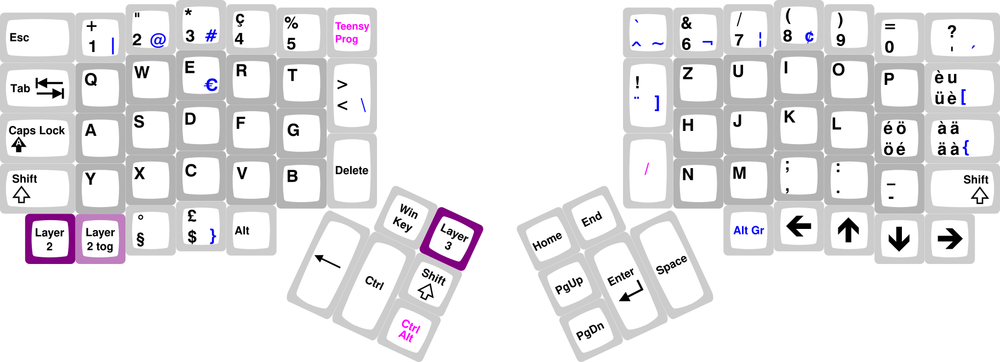

I would not consider myself a tech freak when it comes to hardware. I
particularly dislike chasing the best choice of the next piece of hardware I do not actually
need. Some day back at my internship I had this colleague that owned definitely more keyboard's that he needed, and he was happy to borrow them for however long it was necessary to let you become one more keyboard freak.
It was not all that long.

In the retroperspective it seems so unprogressive. We have been typing on the same type of input devices since the early days of typewriters.
They were impressively small mechanical machines, so it used to be expensive and meant something to own a decent model from a celebrated brand with a dedicated store.
My mum told me about her using one at her first office job, when she still was one of the few to know how to properly write on this machines.
She did not know till I showed her that the layout was designed to fulfill the machine's requirements - not the human's needs. The position of the keys is shifted every row to allow the mechanics to work. It becomes obvious when we look at [antique typewriters](https://www.antiquetypewriters.com/collection/).
Also got the letters placed such that the interference of adjacent keys is minimized. While this little machines mirror a lot of the last century's developments, the layout did not change all that much. We should question that.

My colleague lent me the most nerdy thing at that time right away: 
a crowd-sourced [_Ergodox Mechanical Keyboard_](https://www.ergodox.io/), that had to be self-soldered from individual parts. Not expecting to actually buy one, I gave it a try and was fluent after less than a week. Way more time went into fine-tuning the layout. After two weeks I joined the running mass order.

What convinced me? Some models like [this one](https://www.antiquetypewriters.com/typewriter/franklin-2-typewriter/) had already a superior design, where your arms can stay in a relaxed angle. That is what the Ergodox perfectionates for me: _the split design_. Since my arms can stay straight, my shoulders and chest can remain open and more relaxed. On top you have the ortholinear positioning of the keys better matching my non-curved fingers and the high configurability _of the keyboard's firmware itself_.


## Layout

My software settings are set to use a Swiss German layout since I was used to it and actually like it. It is made to allow for easy typing of french and Italian accents with shifted keys (only one modifier) and so it supports many European languages. As you will see, you can tune any layout into a powerful one anyway, but I wanted to keep my Ergodox "compatible" with my laptop's built-in Swiss German layout. "Compatible" means to either position a symbol on the analogous spot on the Ergodox or move it _far enough_, like to the thumb keys, to not confuse my brain. This worked fine and I can instantly switch between the Ergodox and a classical one if I need to.


The downside of this layout is the position of the brackets, especially `()` that I use very frequently as a programmer. With the free positioning in the keyboard's firmware you can move them everywhere, but there are not many spare spaces on the keyboard after placing all the letters.

That's where the most powerful feature of the firmware helps out: **layers**. Layers are completely independent layouts that you can push on top of the base layer to build a stack of layers. The push happens by any key you like, and it can be

- temporary; _while you hold_ or
- persistent; whenever you _toggle_ a key.

Why does the order of the layers in the stack matter? To simplify configuration, you can have transparent keys on higher levels to maintain the function of the base layer or a layer below that does not have a transparent key at the specific place.

On my _brackets-layer_ I can arrange my brackets however I wish, for example next to each other. I still wanted them to be accessible with just one extra key hold, which is the temporary layer switch, which means I cannot use another _modifier key_. Luckily the `tmk_keyboard` firmware allows you to send a modified key code in just a single press of a key.



Another distinct feature of the `tmk_keyboard` firmware is that you can combine multiple _modifiers_ like `Ctrl` and `Alt` into one key press. With this you can have advanced desktop manipulation functions that are usually two or even three _modifiers_ plus a normal key in just one _modifier_, for example `Ctrl + Alt + ARROW KEY` to switch to another virtual desktop and `Ctrl + Alt + Shift + ARROW KEY` to move a window there.


## Firmware

I use a fork of an alternative firmware [tmk_keyboard](https://github.com/cub-uanic/tmk_keyboard) which I made available here:

```shell
git clone https://github.com/gitsimon/tmk_keyboard
```

After cloning, switch to

```shell
cd tmk_keyboard/keyboard/ergodox/
```

In this directory you can find the default layouts and my layout [`keymap_smartnuance.c`](https://github.com/gitsimon/tmk_keyboard/blob/master/keyboard/ergodox/keymap_smartnuance.c). Build it with

```shell
make -f Makefile.pjrc KEYMAP=smartnuance
```

## Links
The mass-produced [successor](https://ergodox-ez.com/) of the model I own can be found here. (I do not have any sort of affiliation with them.)