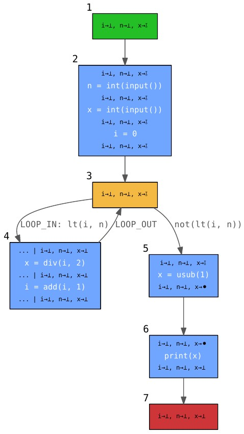

# Non-technical introduction

I was always excited by the type systems behind common languages, their
strengths and weaknesses. That is why I got also interested in what properties
of a program are possible to proof without actually executing it. In the
computer science field of _static analysis_ a helper program is designed to
analyse certain properties of your main program. It can be written in the same or in a different language as the program to analyse. One has to use powerful formal
methods to show that the analysis algorithms implemented in the helper program are sound
within the execution model of the analysed program's language.

I built fundamental parts of a generic
[Static Analyser](https://github.com/gitsimon/spadup-lyra) for Python that
analyses program to detect unused variables. The analysis results or more precise compared to usual analysis present in many development environments (IDEs).

**Download** full [Master Thesis](./Master_Thesis.pdf)

**Checkout Repo** with [Code of Static Analyser](https://github.com/gitsimon/spadup-lyra)

# Example

This program written in the Python language has a bug in line 7.

```python{5,7}{numberLines: true}
n = int(input())
x = int(input())
i = 0

# RESULT: i→⊥, n→⊥, x→⫰̸
while i < n :
    x = i / 2 # Bug : should be x = x / 2
    i = i + 1
else :
    x = −1

print(x)
```

The result of the analysis written in line 5 `x→⫰̸` finds that variable `x` is no used further down in the program. This in turn means that the input value read into `x` is never used, which is probably a mistake.

This control flow graph generated by my analyser shows the abstraction of the program and the intermediate results of the _backwards analysis_ leading to the conclusion in line 5:



# Abstract

We introduce a new property of program inputs that denotes if the input is used
and develop a fully-automatic, static analysis within the framework of Abstract
Interpretation to approximate this property for both single inputs and input
lists of unknown length. The developed analysis extends the well-studied
truly-live variable analysis to the stronger property of usage: It detects for
input items, or more generally for any program variable, if they have any effect
on the output of the program. In Abstract Interpretation, an interpreter
iterates over the code of a program without executing it on concrete inputs, and
imitates parts of its behaviour with objects of an abstract universe, called
abstract domain. Our analysis roots in an abstract usage domain, which holds
information about which variables are used and how they can affect the usage
property of other variables along the possible execution paths of the program.
Combined with a stack-like structure, it can track the flow of usage through
nested constructs like conditionals and loops. We can differentiate direct usage
in the program output from implicit usage in conditions and transitive usage via
assignments. We then extend the usage domain to be able to track the usage
property not only for variables, but also for list items. This means we can find
out if the individual values of a list of inputs are used, even if the length of
the list is statically unknown. We achieve this by integrating the usage domain
into an abstract domain to analyze list contents. This domain is based on the
idea of splitting the list into segments with dynamic bounds, each segment
holding an abstraction of the values the segment is covering. A prototype
implementation of all presented domains and analysis was developed alongside
this thesis. It demonstrates the potential usage scenarios in real-world
programs typically written in data science applications.

**Download** full [Master Thesis](./Master_Thesis.pdf)

**Checkout Repo** with
[Code of Static Analyser](https://github.com/gitsimon/spadup-lyra)
