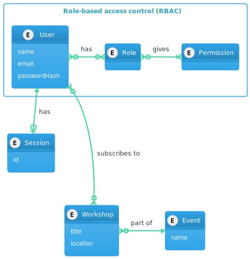
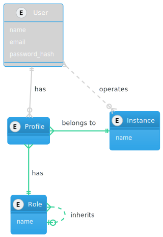
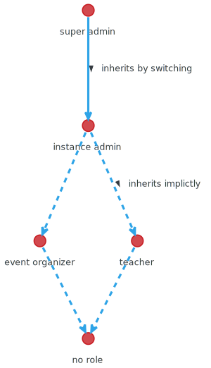
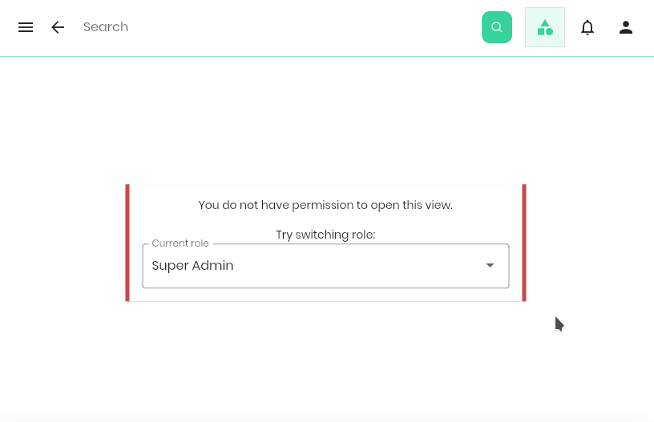
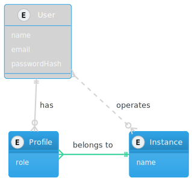
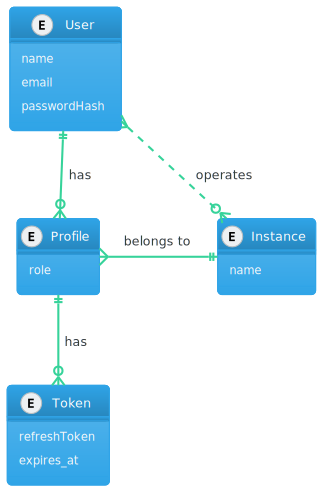
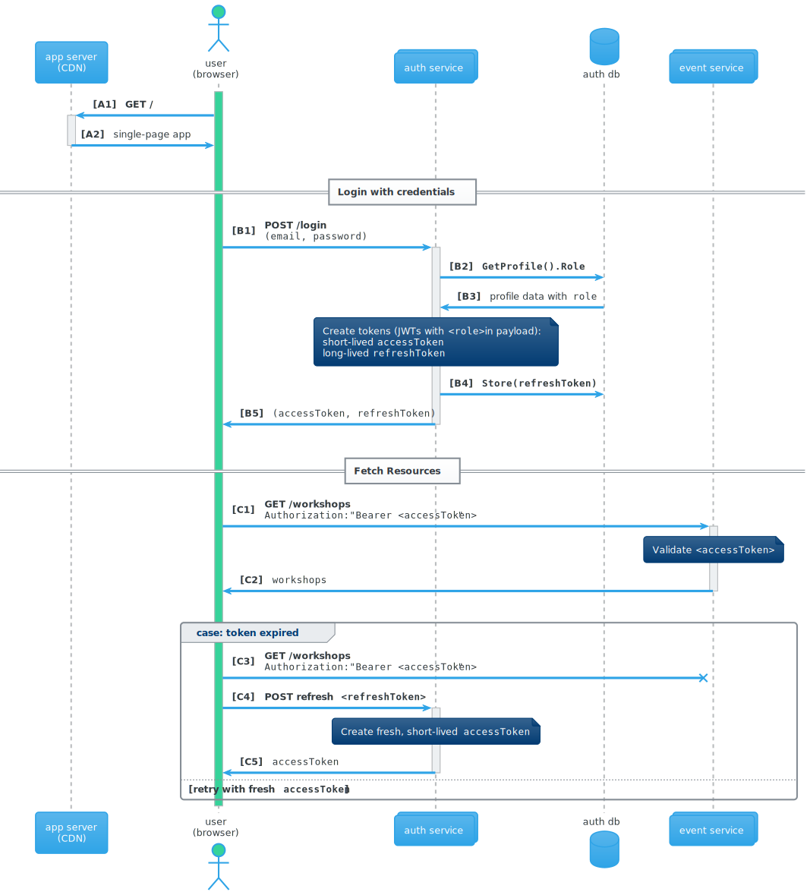

Check out the <a href="https://admin-kit.smartnuance.com" target="_blank">demo</a> backed by an instance of the SaaS kit.

View [code on GitHub](https://github.com/smartnuance/saas-kit). It's open-source and free to use (MIT licensed).

## What is the go SaaS kit? {#what}

This open-source kit gives you a jump start for your next SaaS backend. It combines the benefits of a streamlined developer experience familiar from monolithic frameworks with the design advantages of microservices (checkout ["Soft factors of microservices"](/blog/microservices)).
Coded 100% in Go, this kit provides a highly opinionated template how to write services along with a few ready-to-go services for fundamentals like authentication/authorization for the customers of your SaaS.

Developing and testing microservices on the developer's machine used to be cumbersome.
**That's why services are structured such that they can transit from running in a single-process to a distributed service mesh with a few lines of configuration changes.** On the developer machine you run a single command to spin up your interconnected services as you know it from working on a monolithic application.


## Opinionated choices {#choices}

The design of microservices is all about _separation of concerns_. Still, there are some decisions that you want to take initially and globally (for the services you control). In the coming sections I will explain why I made some of this opinionated choices:

<Alert>
    The list also serves as in index for this article.
</Alert>

- [Hierarchical role-based authorization](#hrba) as a simpler alternative to the popular [role-based access control (RBAC)](#rbac) model, moving permission check back into straight-forward _conditionals_ in code
- [Authentication service](#token-authentication) realizing a variant of token-based authentication

**In separate articles:**
- [Faster integration tests](#testing) to run and test all services in a single process during development
- [Continuous delivery with infrastructure as code](#cd)


Let's first look how a the database schema would look like for a monolithic architecture with a similar feature scope as covered by the SaaS kit presented later: session-based authentication, role-based access control and some business specific entities, an event system with events and workshops entities:


<Alert>
    I'm using <a href="https://vertabelo.com/blog/crow-s-foot-notation/">Crow's foot notation</a> in the displayed ER-diagrams.
</Alert>

The diagram shows the central table for storing users with common attributes like name and a salted password hash. A row in the _User_ table is potentially related to

- zero, one or multiple roles in the _Role_ table, where a subset of a curated set of permissions from the _Permission_ table can be assigned to each role,
- zero or one session with an _id_ to store user related session data loaded whenever the user provides his session ID (by a cookie) along with a request,
- some workshops he is subscribed to (note that the intermediary table is tied to both _User_ and _Workshop_ from the event system's business entities).


## The issue with role-based access control {#rbac}

Let's look closer at the tables from the above diagram that are part of the access control:


Request-processing code would operate only on the level of _Permissions_, checking if the authenticated user (by the session) has a certain permission that is required to continue execution to read/update/delete a resource. Permissions might also limit access in a fine-grained manner like expressing the capability "to create an event if there is no event with the same name". **The essence is that, during the request processing flow, several permission checks are performed where each one potentially leads to the abortion of the process** (with a _HTTP 403  Forbidden_ status code).

The issue I encountered with this approach is that the coupling between permission checks in the code with the often manual curation of permissions and roles over some access control management interface, updating the above tables. In other words, it is very easy to have one permission not assigned to a role that indeed should have that permission to allow any user in that role to conclude his journey.

This problem becomes even more obvious when a developer adds a additional permission check to the code. **At the time of the production deployment of his change, the permission has to be added to one or several roles in the RBAC tables**, otherwise the related user journeys are broken.

This synchronization between a human curator of permissions with the moment a developer's change is going live contradicts the goal of continuous (and commendable hands-free) deployment. Note that even integration tests might not block the change from going to production when running on a test cluster, because they could succeed upon working with a state of the RBAC tables in the test environment where the correct set of permissions on roles are set.

To understand how I arrived at my design proposal for _hierarchical role-based authorization_ below, I want to show one more problem with traditional RBAC. Assume the permissions assigned to roles need to be parameterized by one or more dimensions. Since our SaaS is aimed to be multi-tenant, a classic example of such a dimension could be the _tenant_ (I call it _instance_ so that one tenant could sign up for multiple instances within your system). **Parameterizing permissions by an _instance_ requires traditional RBAC to replicate the set of permissions for each _instance_**:

```go{1}{numberLines: true}
if !permissions.has(user, "create_event_for_smartnuance.com") {
    // return 403
}
```

Alternatively we could hard-code the checks for the right instance along with a instance-generic permission check:

```go{1,2}{numberLines: true}
if !(permissions.has(user, "create_event")
    && instance.canActFor(user, "smartnuance.com"))) {
    // return 403
}
```

For other dimensions we would add different additional checks. That works, but curating permissions and roles in the database gets obfuscated. Again, it's too easy to break features an user in a certain role should be able to use by messing up with the exact set of necessary permissions. Running into this issue over and over again in a Django-based product, I reached the conclusion it's sane to go all-in and give the power for sophisticated authorization checks to the code, to the developers.


### Hierarchical role-based authorization {#hrba}

The alternative I propose has a longer name but is indeed simpler in terms of the number of tables it requires additionally to the _User_ table: zero!

First, we get rid of the dynamic permissions in the database all together. An intermediate draft for the entities could look like this:



- We included an _Instance_ table to support multi-tenancy, i.e. separating access control by the SaaS's tenants (we can provision multiple instances for the same customer/tenant).
- We add a many-to-many relation from _User_ to _Instance_, over the intermediate table _Profile_. A user might have profiles for several instances with distinct roles.
- Each profile has exactly one role attached.
- **Roles inherit from at most one other role**.

The last point contains the crucial idea. While we want to enable code to perform whatever sophisticated checks, we want roles to be extendable over time, organizing access control more and more fine-grained with the feature growth of the SaaS. When extending the set of roles, we do not want to adapt all the checks all over our services, at least not instantly. In other words: **Extending the set of roles should not break existing authorization checks.**

Let's see an example of the lattice created by our role inheritance:



- We do not want cycles in the inheritance graph, hence we require it to build a DAG. The even stricter requirement of **the inheritance graph building a lattice** guarantees the existence of a `super admin` role that can do everything, and `no role` that can do nothing else than what an anonymous (not authenticated) user can do.
- some roles are dependent on the _instance_ dimension (like `event organizer`, `teacher` and `instance admin`), the others are independent.
- We introduce two type of directed edges between nodes (roles):
  - The **implicitly inherited roles** build a transitive closure "below" a given role that a user can act in implicitly.
  - The other edge type denotes **inheritance by switching** temporary but explicitly into another role to gain the capabilities of the inherited roles (but maybe loose some of the current capabilities). 

A check in code reads as simple as:

```go{1}{numberLines: true}
if !(roles.CanActIn(ctx, "teacher")
    && roles.CanActFor(ctx, "smartnuance.com") {
    // return 403
}
```

And this check is written indifferent to the user's current role. If his role is `instance admin`, the check validates successfully. If his role is `super admin`, he first needs to switch to the `teacher` role (or `instance admin` role):

```go{2,9}{numberLines: true}
// User requests switching
err := roles.SwitchTo(ctx, "instance admin")
if err != nil {
    fmt.Print(err)
    return
}

// in a later request
if !(roles.CanActIn(ctx, "teacher")
    && roles.CanActFor(ctx, "smartnuance.com") {
    // return 403
}
```

In the UI the role switch could look like this:



Requiring an explicit switch for some role transitions helps protecting more powerful user to accidentally modify the wrong data, both by a human mistake or a due to a bug.

Reviewing our thought experiment of gradually extending roles, we can always add new, more specific roles that inherit from an existing role. The code checks using the inherited role will still validate successfully, and can be later narrowed down to ask for more specific roles.

Previously I showed the database to store the roles in a separate table. Since we are referencing specific roles in our checks in code, I went one step further and eliminated this extra table as well, storing the role as single string in the profile and representing [the hierarchy of roles in code](https://github.com/smartnuance/saas-kit/blob/b08b75a9804b396dcc2a4645a22a6d4b82234f36/pkg/lib/roles/roles.go#L47) as well:




## Scalable Token Authentication {#token-authentication}

In this section I would like to introduce the variant of token-based authentication/authorization that is supported out-of-the box by the SaaS kit.

We deal with two types of tokens: _access tokens_ and _refresh tokens_.
We only persist _refresh tokens_, therefore we extend the above ER-diagram with a table that stores refresh tokens, since we want to be able to revoke them when they get leaked.



Let me present the full flow of how a user authenticates and later fetches a protected resource:



- (**A**) The user's browser fetches the application from a CDN, more precisely, the statically generated sources that display the UI on the browser.
- (**B**) Login with credentials:
  - The user authenticates himself against the _auth service_ by entering his credentials in a login mask (**B1**).
  - The _auth service_ checks for a profile matching the user's provided email (**B2**) (and other dimensions like the instance to operate on), validates the password's hash and fetches the profile's role (**B3**). Then the _auth service_ generates two tokens: a short-lived `accessToken` and a long-lived `refreshToken`. Only the `refreshToken` is stored (**B4**) to the _auth db_ to make it possible to later mark the token as invalid when revocation of that token all all token's by a certain user is triggered.
  - The pair of token is returned to the user (**B5**).
- (**C**) Fetch resource:
  - The user fetches a resource from an endpoint of a resource service's API, e.g. workshops from the _event service_. He provides the `accessToken` in an authorization header (**C1**). The _event service_ needs no communication to the _auth service_ to validate the signature of the received `accessToken`, since it's a JWT signed by the _auth service_'s private key and the _event service_ has an authenticated copy of the corresponding public key ready (i.e. distributed by the deployment).
  - When the validation of the signature is successful and the role contained in the JWT is sufficient to access the resource, workshops are returned (**C2**).
  - If the validation fails because the token is expired (**C3**), the user is informed about the cause. He can request a fresh `accessToken` (**C4**) from the _auth service_ if he still possesses the `refreshToken` and this token is not expired in turn. When a fresh `accessToken` is returned (**C5**), the user can retry fetching the resources previously failing.


## Faster integration tests {#testing}

Abstracting the final _runtime_ each service is executed in and the details of how networking between them is organized enables more powerful approaches to testing. While for production we want services to run, fail and scale independently, in tests we want to focus on one layer at a time.

Every developer should be familiar with unit tests. Their are used to test at a function/method level and they are concerned about at most one package. The are helpful to
- spot errors in the implementation (compare [Test-Driven Development (TDD)](https://www.youtube.com/watch?v=Jv2uxzhPFl4&t=73s)),
- ensure proper separation of concerns into modules and functions,
- detect breaking code upon changes, be it newly added features, bug fixes or library upgrades.

In microservice architectures, **the tricky challenge becomes testing the combined behaviour of multiple services**. Ideally this behaviour can be tested from a single process, removing the impact from networking, startup failures of services or infrastructure instabilities in general. It is good practice to test the services operational resilience upon failure of these parts, but **we rather want to programmatically inject network and infrastructure failures**.

Thus, _Integration tests_ that are traditionally executed by temporary deploying code changes to a test cluster and then running tests on this production-similar environment are not a good solution. They have their place, but rather in a variant called _smoke tests_. I like to describe smoke tests as a subset of integration tests run in a production-similar environment, checking that the most important user journeys work and there is "no smoke".

In a separate article we will explore how we use an opinionated service setup to make it possible to run all services in a single process during development and integration testing. In that setup, developers write and run integration tests locally while coding, just after they wrote and run unit tests. They can become part of the [Test-Driven Development (TDD)](https://www.youtube.com/watch?v=Jv2uxzhPFl4&t=73s) strategy, which means they are easy to run before merging your code changes and running your CI pipeline because they need less setup and run as fast as unit tests.

## Continuous delivery with infrastructure as code {#cd}

Currently I use [EARTHLY](https://docs.earthly.dev/) for creating a straight-forward [build process](https://github.com/smartnuance/saas-kit#build-services) with [build jobs for GitHub](https://github.com/smartnuance/saas-kit/blob/b08b75a9804b396dcc2a4645a22a6d4b82234f36/.github/workflows/main.yml).

In a separate article I will write more about a complete infrastructure as code (IaC) setup for deploying the SaaS kit with confidence.
The plan is to use [terraform](https://www.terraform.io/) and [kubernetes](https://kubernetes.io/) for orchestrating the individual services, but user some developer tooling on top to make it easier to **change and especially validate** your infrastructural changes.

## Credits
Image Source:
https://unsplash.com/photos/3D1Hjp4_nII