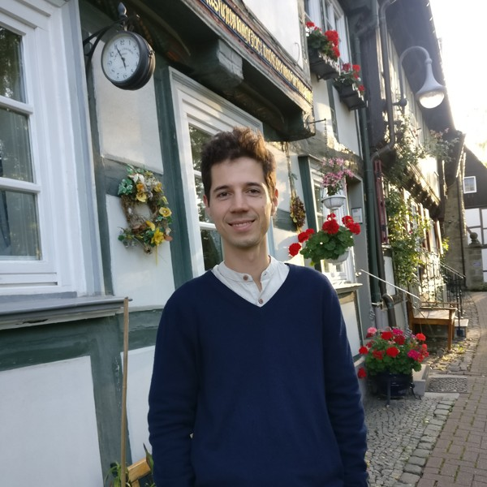

This page is a little self-centered. I talk about a specific but diverse topic, about myself.

I'm a visionary for software engineering and a pragmatist in writing code.
As a kid I tried doing art on my father's old Macintosh. When I
learned programming Java at middle school, the immense possibilities of the
digital world became apparent to me. It was like LEGO, just with an infinite
number of pieces. Until today I still prefer blank paper to develop ideas and I
believe most great engineering is originating from a pencil. Code is what makes
software engineering products accessable for everyone. Sometimes a quick
prototype is what validates an idea. Sometimes we want to reach clients of a
full continent or even the whole world. And the difference is made just by the
click-clacks of my keyboard.

Recently I decided I'm still too young to stay at one company until all my hair
is grey and I started to work as a freelancer. Checkout [what I can offer for
you](/ "Offers").

## Technology that I use and still like

The only cliche about programmers that holds true for me is my adoration
of coffee. I usually enjoy a _Flat White_ I produce manually by my old-school
_Bialetti_. Definitely a good start into a high motivation day using some of this technologies:

|                                                                                                                                                   |                                                                                                                                                                                                                                                                                                                                                                                                                                                        |
|---------------------------------------------------------------------------------------------------------------------------------------------------|--------------------------------------------------------------------------------------------------------------------------------------------------------------------------------------------------------------------------------------------------------------------------------------------------------------------------------------------------------------------------------------------------------------------------------------------------------|
| [Golang](https://golang.org/)                                                                                                                     | Used it daily for my full-time job to build **microservices**. The language and its great standard library is so easy to learn. I became an expert in this language and enjoy working with it.                                                                                                                                                                                                                                                         |
| [Python](https://www.python.org/)                                                                                                                 | Used it at university, my student jobs, mostly together with [Django](https://www.djangoproject.com/) for web projects and [Jupyter](https://jupyter.org/) / [Pandas](https://pandas.pydata.org/) for scientific projects. I like it for its diversity, ecosystem and it is still the fastest way to build prototypes or combine existing systems.                                                                                                     |
| [Docker](https://www.docker.com/) & [Kubernetes](https://kubernetes.io/)                                                                          | It was the backbone of **running incrementally updated microservices** at work. Since the cloud providers leave the fine tuning of their services to developers, I learned about its strengths and pitfalls and how to make it a rock solid deployment strategy.                                                                                                                                                                                       |
| [Google Cloud](https://cloud.google.com/) & [Microsoft Azure](https://azure.microsoft.com/) (managed with [Terraform](https://www.terraform.io/)) | I was lucky to work with both clouds on projects scaling to multiple regions. I'm used to having a staged deployment strategy with at least three stages and automated tests to ensure continuous deployments never break the production system. I was specifically involved in configuring cloud infrastructure to enable **system tests running over multiple services**, both on deployed systems and as part of a continuous integration pipeline. |
| [PostgreSQL](https://www.postgresql.org/)                                                                                                         | Some classic things are here to stay. For most problems, even in distributed microservice architectures, (multiple) PostgreSQL databases are still the best choice for clean data organization.                                                                                                                                                                                                                                                        |
| [Flutter](https://flutter.dev/)                                                                                                                   | In my last project at work, we built a stock receipt management platform interfacing with a Flutter app developed by us as well. The app facilitates the work of thousands of employees. I was code owner for the **distributed & offline capable authentication process** and ensured its security. Also I architectured complex form validation based on data fetched from asynchronous synchronization of huge amounts of base data.                |
| [ReactJS](https://reactjs.org/)                                                                                                                   | My choice for side projects that really asked for a highly interactive web interface.                                                                                                                                                                                                                                                                                                                                                                  |
| [Java EE](https://www.oracle.com/ch-de/java/technologies/java-ee-glance.html)                                                                     | In my internship at [ergon](https://www.ergon.ch/en) I got in touch with the Java EE stack and built a visual configurator with Java Swing and custom extensions. In my first project at _freiheit.com_ I also used [Spring Boot](https://spring.io/projects/spring-boot) to build a customizable real estate search.                                                                                                                                  |

This site is built using [Gatsby](https://www.gatsbyjs.com/), a static site generator
based on [React](https://reactjs.org/) allowing me to write this content in
lovely simple
[Markdown](https://guides.github.com/features/mastering-markdown/). The site is hosted
on [GitLab Pages](https://docs.gitlab.com/ee/user/project/pages/).

## My work stack

|             |                                                                                                                                          |
| ----------- | ---------------------------------------------------------------------------------------------------------------------------------------- |
| Text Editor | [Visual Studio Code](https://code.visualstudio.com/) and sometimes [IDEs from Jet Brains](https://www.jetbrains.com/de-de/products.html) |
| Terminal    | [Oh my Zsh](https://ohmyz.sh/)                                                                                                           |
| Computer    | [Thinkpad X1 Carbon Gen 8](https://www.lenovo.com/ch/de/laptops/thinkpad/thinkpad-x1/X1-Carbon-Gen-8-/p/22TP2X1X1C8)                     |
| Keyboard    | The self-soldered version of an [Ergodox EZ Mechanical Keyboard](https://ergodox-ez.com/)                                                |
| UI Design   | Pen & blank paper, sometimes [Figma](https://figma.com)                                                                                  |
| Headphones  | I love silence at work, but I do play the violine or the guitar when I need a virtuosic break.                                           |  |
| Inspiration | This I get from mindful Yoga breaks or by having a swim in the beautiful atlantic ocean.                                                 |  |

